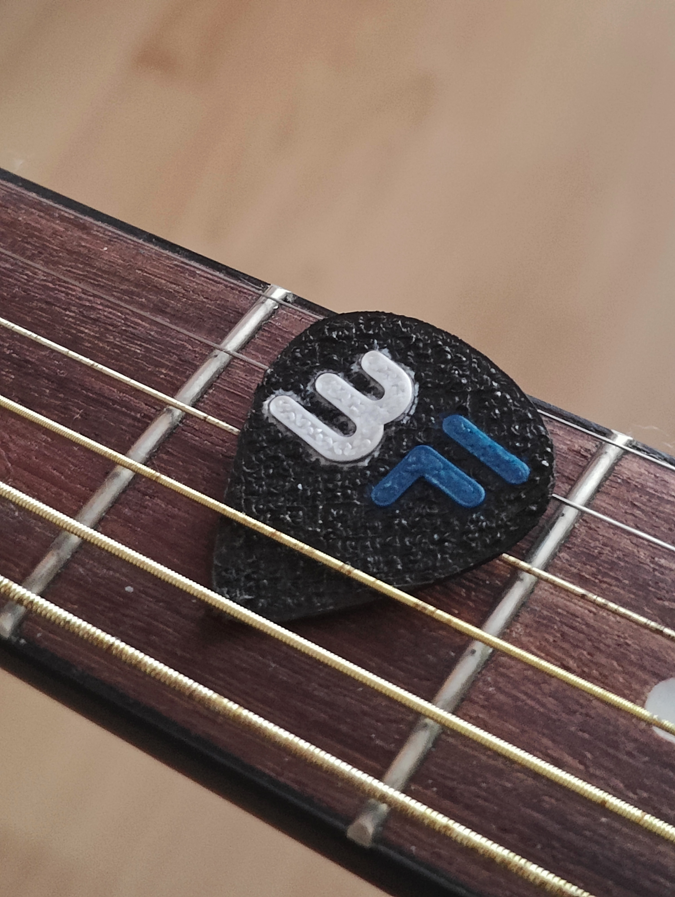

# ByteForce Guitar Pick

## Project Overview
The ByteForce Guitar Pick is a custom plectrum designed in Blender and 3D-printed on a Bambu Lab printer. It combines a clean logo, ergonomic grip, and tapered tip into a durable, playable design.

## Highlights
- **Solo build:** Modeled, iterated, and printed as a one-day project.
- **Bambu Lab ready:** Optimized for a Bambu Lab printer, using a 0.4 mm nozzle and typical PLA settings for a crisp logo emboss and rounded edges.
- **Functional ergonomics:** Slightly oversized grip area, tapered tip, and smoothed chamfers for fast string release.

## Repository Contents
| Path | Description |
| --- | --- |
| `bf guitar pick.blend` | Native Blender file containing the complete scene, modifiers, and logo curves. |
| `bf guitar pick.stl` / `bf guitar pick flat.stl` | Exported meshes for curved and flat-back variants. |
| `bf guitar pick.3mf` | Pre-sliced Bambu Studio project including print profile presets. |
| `STL/` & `SVG/` | Auxiliary exports used for testing and logo work. |
| `Photos/` | High-resolution photos of the finished pick in use and on the workbench. |

## Printing Notes
1. Slice `bf guitar pick.stl` in Bambu Studio (or your slicer of choice) with a 0.12-0.16 mm layer height and 3 perimeters to preserve the emboss.
2. Enable a brim if you notice any bed adhesion issues; the geometry is small and benefits from extra stability.
3. I printed in PLA, but PETG or nylon will offer increased durability if you prefer stiffer picks.
4. Light sanding on the tip after printing removes stray layer lines and produces a smooth attack.